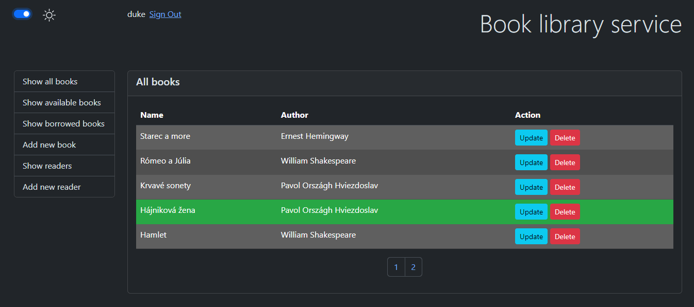

[](https://github.com/BranislavBeno/Book-Library-Service/actions/workflows/04-run-tests.yml)
[](https://github.com/BranislavBeno/Book-Library-Service/actions/workflows/05-build-and-deploy-application.yml)  
[](https://sonarcloud.io/summary/new_code?id=BranislavBeno_BookLibraryService)
[](https://sonarcloud.io/summary/new_code?id=BranislavBeno_BookLibraryService)
[](https://sonarcloud.io/summary/new_code?id=BranislavBeno_BookLibraryService)  
[](/app/build.gradle.kts)
[](/app/build.gradle.kts)
[](/app/build.gradle.kts)
[](/gradle/wrapper/gradle-wrapper.properties)
[](https://opensource.org/licenses/MIT)

# Simple web application for book library service
This application allows providing usual actions with a book library, such as:
- view paginated all books (highlighted whether are borrowed or available)
- view paginated only available books
- view paginated only borrowed books
- add a new book into the library
- update book data
- remove book from library
- borrow and return book

> Application listens on port 8080.  
> It offers web UI and REST API interface as well.

### Configuration
The following application settings are configurable over application.yml file:
- book.repository.path - input file destination
- book.service.page.size - page size for paginated outputs
- auth.users - list of users defined by its usernames

Every username definition requires setting password and role.
Only users with `admin` role are allowed to make changes in repository.
Users with different roles are allowed only to watch/fetch listed data.

> By default, are available following users:
> - username=duke (password=stratospheric, role=admin)
> - username=mike (password=MikePass, role=user)

### Web UI usage



To start the application open terminal, change a path to project root folder and run `./gradlew :app:bootTestRun`.  
After the application starts, click on http://localhost:8080/  
To log in use link `Sign in` on top of the page.

After successful login, web UI offers the following types of view:
1. _*All books*_. Borrowed are highlighted red, available green. This view allows book data updating or book removal from the library.  
   Book data updating doesn't allow borrow or rent book.
2. _*Available books*_. This view allows a book borrowing.
3. _*Borrowed books*_.  This view allows a book returning.

For the user with admin rights, the main page offers also:
- adding a new book into the library.
- viewing and updating existing readers.
- adding a new reader into the registry.

### REST API usage
For sending requests and receiving responses use `Postman`, `curl` or web browser.

> All endpoints are secured with basic authentication (see [Configuration](#configuration))

#### API description
Following endpoints are available for usage:

- **GET /api/v1/book/all?page={pageNumber}** - returns required page from a list of all books or empty list when no book was found.
- **GET /api/v1/book/available?page={pageNumber}** - returns required page from a list of available books or empty list when no book was found.
- **GET /api/v1/book/borrowed?page={pageNumber}** - returns required page from a list of borrowed books or empty list when no book was found.
- **POST /api/v1/book/add** - adds a new book into the library.  
> Input is validated. Book author can't be empty. Book name can't be empty or longer than 15 signs.

  Request body example for a new book adding:
  ```json
  {
     "name": "My memories",
     "author": "John Doe"
  }
  ```
- **PUT /api/v1/book/update** - updates book data. Operation is refused when a book with given ID doesn't exist.  
> Input is validated. Book author can't be empty. Book name can't be empty or longer than 15 signs.

  Request body example for existing book updating:
  ```json
  {
     "id": "1",
     "name": "My memories",
     "author": "John Doe"
  }
  ```
- **DELETE /api/v1/book/delete?bookId={id}** - deletes book with given ID. Operation is refused when a book with given ID doesn't exist or when book is still borrowed.  
- **PUT /api/v1/book/avail?bookId={id}** - makes an available book with given ID. Operation is refused when a book with given ID doesn't exist.  
- **PUT /api/v1/book/borrow** - borrows the book. Operation is refused when a book with given ID doesn't exist.  
> Input is validated. The Date of borrow can't be later than today.

  Request body example for book borrowing:
  ```json
  {
     "bookId": "1",
     "readerId": "1",
     "from": "2023-01-05"
  }
  ```
- **GET /api/v1/reader/all?page={pageNumber}** - returns required page from a list of all readers or empty list when no reader was found.
- **POST /api/v1/reader/add** - adds a new reader into the registry.
> Input is validated. Reader's first name and last name can't be empty.

  Request body example for a new reader adding:
  ```json
  {
     "firstName": "John",
     "lastName": "Doe",
     "email": "john@example.com"
  }
  ```
- **PUT /api/v1/reader/update** - updates reader's data. Operation is refused when a reader with given ID doesn't exist.
> Input is validated. Reader's first name and last name can't be empty.

Request body example for existing reader updating:
  ```json
  {
     "id": "1",
     "firstName": "John",
     "lastName": "Doe",
     "email": "john@example.com"
  }
  ```
- **DELETE /api/v1/reader/delete?readerId={id}** - deletes reader with given ID. Operation is refused when a reader with given ID doesn't exist or when reader has still borrowed any book.
